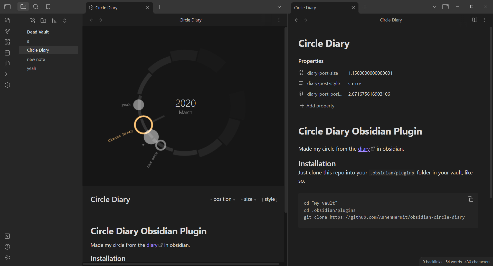

# Circle Diary Obsidian Plugin

Made my circle from the [diary](http://ashen-hermit.42web.io/my_diary/) in obsidian.  
sorry for the bad code, I was in a hurry.

<a href="screenshot.jpg"></a>

### Installation
Just clone this repo into your `.obsidian/plugins` folder in your vault, like so:
```
cd "My Vault"
cd .obsidian/plugins
git clone https://github.com/AshenHermit/obsidian-circle-diary
```
